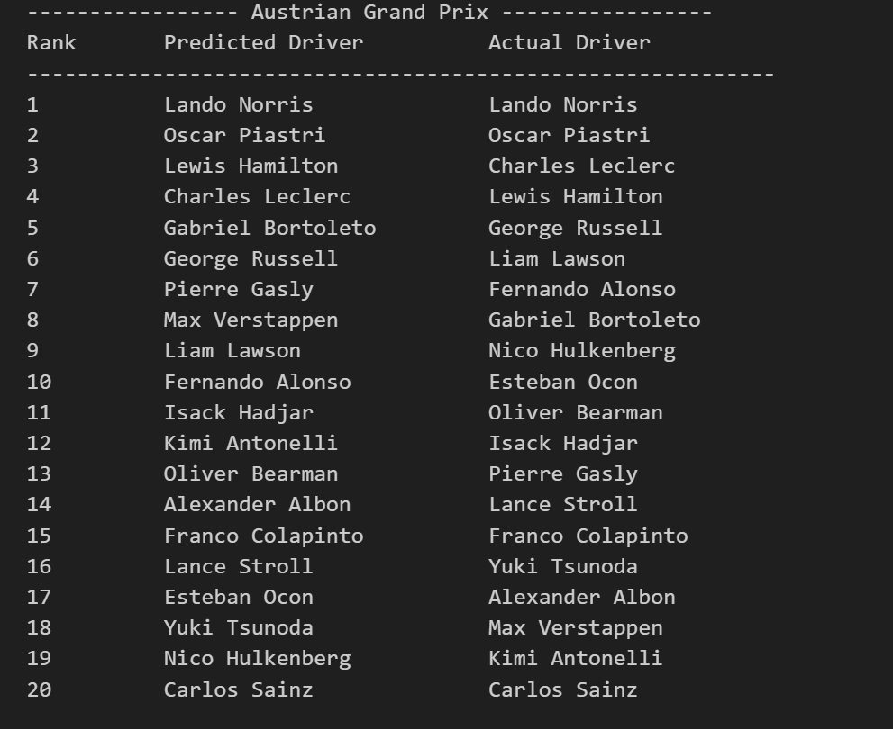

# 🏁 F1 Race Result Predictor

A deep learning project that predicts Formula 1 race results using qualifying, practice, and team data. It leverages a ListNet-style ranking architecture to model relative driver performance in each race.

## 🎯 Overview

This project uses a neural ranking model inspired by ListNet(paper:- https://www.microsoft.com/en-us/research/wp-content/uploads/2016/02/tr-2007-40.pdf) to predict race outcomes by:

- Collecting real-time and historical data using the FastF1 API
- Training a custom PyTorch model (F1Net) with team and driver embeddings
- Outputting predicted finishing orders for each race (Top 20)
- Supporting testing on upcoming races using only pre-race data

## 🚀 Features

The model uses the following key features:

1. **AvgFPTime** — Average free practice lap time
2. **QualyTime** — Fastest qualifying lap time
3. **QualTimeDelta** — Time gap to the fastest driver
4. **GridPos** — Final starting position after grid penalties
5. **Team_encoded** — Encoded team information
6. **Driver_encoded** — Encoded driver information

## 🧠 Model Architecture (F1Net)

The model incorporates:

- **Embeddings** for Team and Driver
- **Fully connected layers** with LReLU activations
- **Output score** per driver, ranked with ListNet-style loss (KLDivLoss)

## 📊 Dataset

Dataset is saved as `data/combined_driver_data.csv`

- Contains data from 2022 to mid-2025 (round 10)
- Features include: AvgFPTime, QualyTime, QualTimeDelta, GridPos, Team_encoded, Driver_encoded
- Target: FinishPos
- Some missing driver values were manually filled using average values per race instead of dropping drivers completely

*Note: You can also regenerate the dataset using the provided scripts.*

## 🛠️ Installation

To run this project, install the following dependencies:

```bash
pip install torch pandas numpy matplotlib scikit-learn tqdm fastf1 ipython
```

For PyTorch with GPU support, visit: https://pytorch.org

## 🚀 Usage

1. **Run** ``` python setup.py``` **to create all required folders**

### Option 1: Use Pre-built Dataset


1. **Train the model:**
   ```bash
   jupyter notebook model_listnet.ipynb
   ```

2. **Test the model:**
   ```bash
   jupyter notebook model_test.ipynb
   ```

### Option 2: Regenerate Dataset

1. **Create driver data:**
   ```bash
   python create_drivers_data.py
   ```

2. **Combine CSV files:**
   ```bash
   python combine_csv.py
   ```

3. **Clean the data:**
   ```bash
   python data_cleaning.py
   ```

*Note: Dataset will require manual adjustment after generation*

## 📈 Results

### Austrian GP 2025 Prediction


## 📊 Visualization

The project includes correlation plots between different features and finishing positions to help understand feature importance.

## 🔮 Future Improvements

- **Dynamic tensor creation** - Method to create tensors dynamically enabling the model to train on new races
- **LSTM architecture** - Replace current architecture with LSTM-based model to account for driver form over time
- **Live dashboard** - Create a real-time dashboard interface for predictions
- **Grid penalty handling** - Better integration of post-qualifying penalties

## ⚠️ Known Limitations

- The model currently uses qualifying data to estimate starting grid and does not account for post-qualifying penalties
- Training tensors are built statically, limiting flexibility for new race data

## 📁 Project Structure

```
├── data/
│   └── combined_driver_data.csv
├── create_drivers_data.py
├── combine_csv.py
├── setup.py
├── data_cleaning.py
├── model_listnet.ipynb
├── model_test.ipynb
├── austrian_gp_results.png
└── README.md
```

## 🤝 Contributing

Feel free to open issues or submit pull requests if you have suggestions for improvements!

## 📄 License

This project is open source and available under the [MIT License](LICENSE).